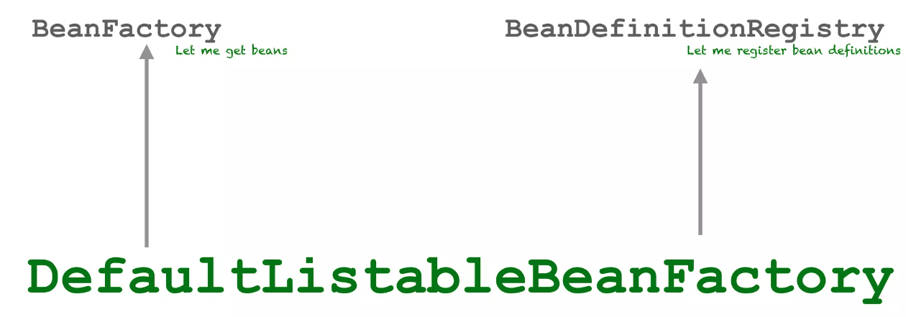
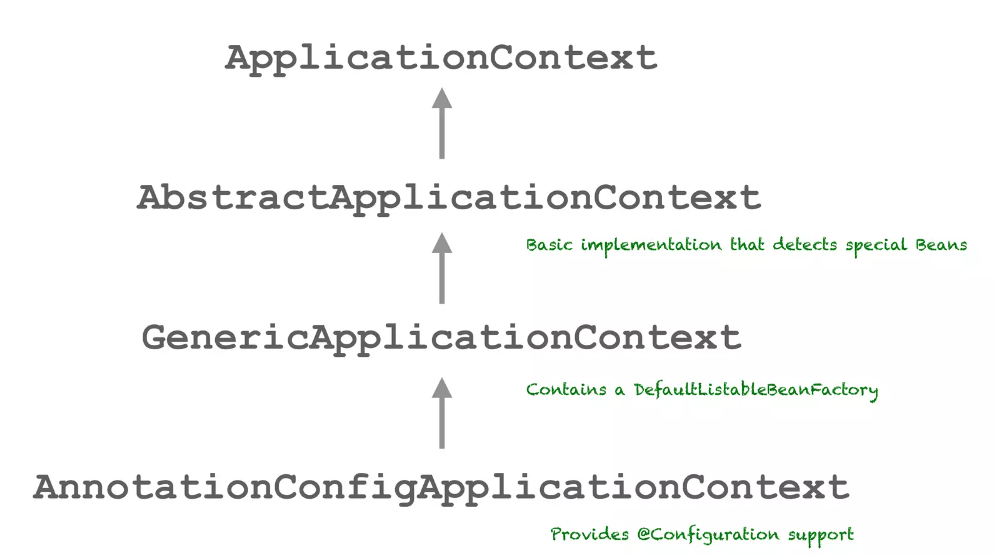
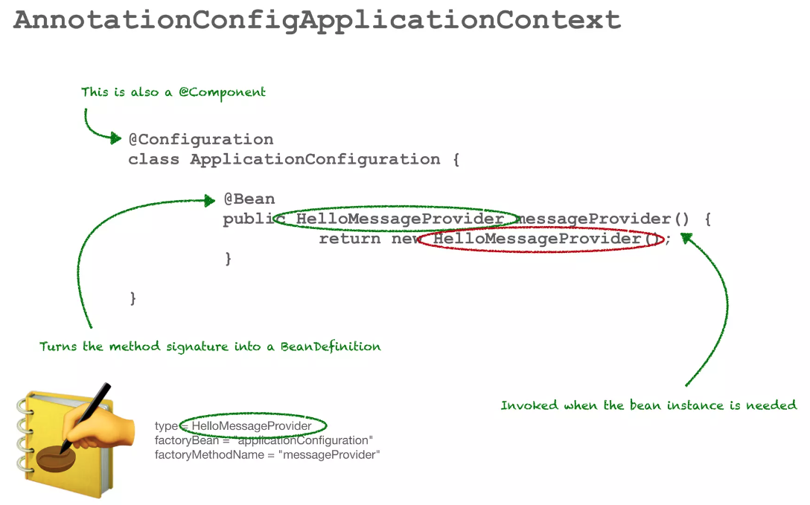
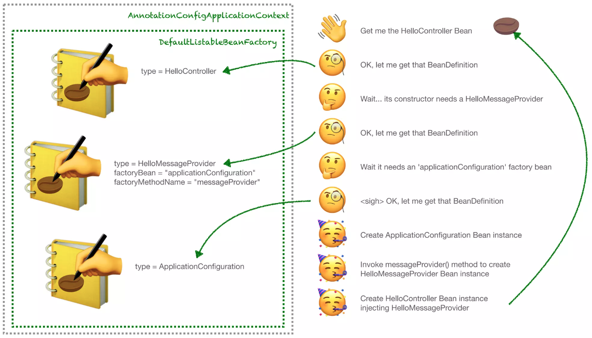
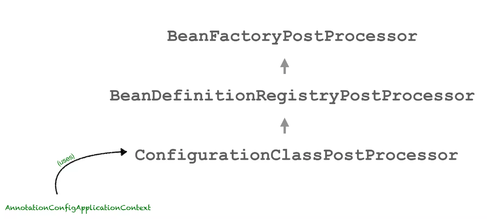

# Demystify Spring Internals

_Note: This document is prepared completely based on [this video](https://www.youtube.com/watch?v=LeoCh7VK9cg&t=1379s)_

- How **Spring** works behind the scene?
- How does **Spring** create and manage all the bean instances?

## `@EnableAutoConfiguration` Annotation


## `@ComponentScan` Annotation
Component in Spring can be scanned in order to create beans. 
`@Component` can be used as meta annotation for these following annotation:
- `@Service`
- `@Repository`
- `@Controller`
- `@RestController` (Meta meta annotated component)

These are all annotated with `@Component` themselves. 

When `@Component` is added to the application, spring looks at all the classes that are present in the package of the class 
that the annotation is declared on, and it's sub-packages. 
It finds candidate component based on the annotation being present on the class and creates bean instances for them. 

```java
class HelloUtils { }
```
No bean will be created for this class. 

```java
@Service
class HelloService {}
```
Bean will be crated for this class as `@Service` annotation is used. 

## How spring creates bean?
Spring first creates bean definition which is a blueprint for a bean instance. 
Bean definition is represented using `BeanDefinition` interface. It has a bunch of metadata on it that tells spring 
what to do when it creates bean instance using the bean definition. Some of the attributes in that metadata include things like -
- Lazy
- Primary
- Scope
- Type
- Factory Method Name
- Init Method Name (Life cycle method)
- Destroy Method Name (Life cycle method)

For example - If `@Lazy` annotation is used, the bean will be created lazily.
There's a lot of bean defs, one for every bean instance that gets created by the framework. 

## Where do we get these bean instances and where do the bean defs gets registered?
At the highest level we have the `BeanFactory` interface which gives us the bean instances using those bean defs.
And we have the `BeanDefinitionRegistry` interface which lets us register bean defs. 

`BeanFactory` is part of the spring beans jar and provides the foundational components for the spring IoC container.

There are many implementations of the `BeanFactory`, but in the framework where two interfaces come together are the 
`DefaultListableBeanFactory`. `DefaultListableBeanFactory` implements both the `BeanFactory` and `BeanDefinitionRegistry` interfaces. 

`DefaultListableBeanFactory` forms the heart of spring, manages bean defs and bean instances. 



## Application Context
`ApplicationContext` is an implementation of `BeanFactory` and it provides some additional functionality on top of the `BeanFactory`.
Some of the additional functionality that `ApplicationContext` provides are - 
- ApplicationEvent Publishing
- Environment abstraction
- MessageSource
- Configuration classes and Scanning

### Hierarchy of `ApplicationContext`



`AbstractApplicationContext` is the base implementation that can detect special beans. These special beans can include 
post-processors such as: 
- BeanPostProcessor
- BeanFactoryPostProcessors

`GenericApplicationContext` contains a `DefaultListableBeanFactory`.

`AnnotationConfigApplicationContext` adds the configuration support and support for scanning. 



`@Configuration` annotation is meta annotated with `@Component` which means it also gets picked up by component scanning. 
When configuration classes are picked up by component scanning, they are scanned for bean methods. 
And when a bean method is found a bean, a bean definition is created for it. 

The bean definition on the figure above is:

```java
type=HelloMessageProvider
factoryBean="ApplicationConfiguration"
factoryMethodName="messageProvider"
```
The bean definition comes from the method signature and not from what gets returned from the method body. 

### Bean instance create flow



This is how `AnnotationConfigApplicationContext` can register and get beans. 

### Process the configuration classes
`AnnotationConfigApplicationContext` uses `ConfigurationClassPostProcessor` to procerss the configuration classes. 
The concept of post-processors is quite prevalent throughout the spring framework. 



When the `ConfigurationClassPostProcessor` finds the beans that are defined in the configuration class
it creates bean definitions and registers them because it implements the bean definition registry.


#### Ref:
- https://www.youtube.com/watch?v=LeoCh7VK9cg&t=1379s
- 